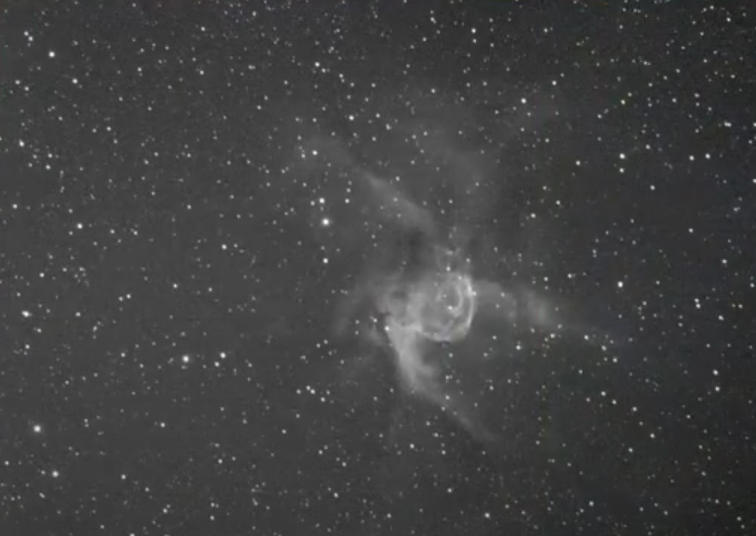
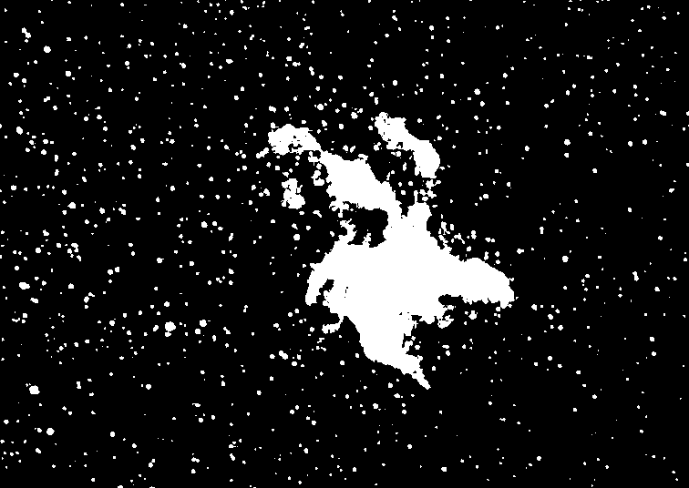
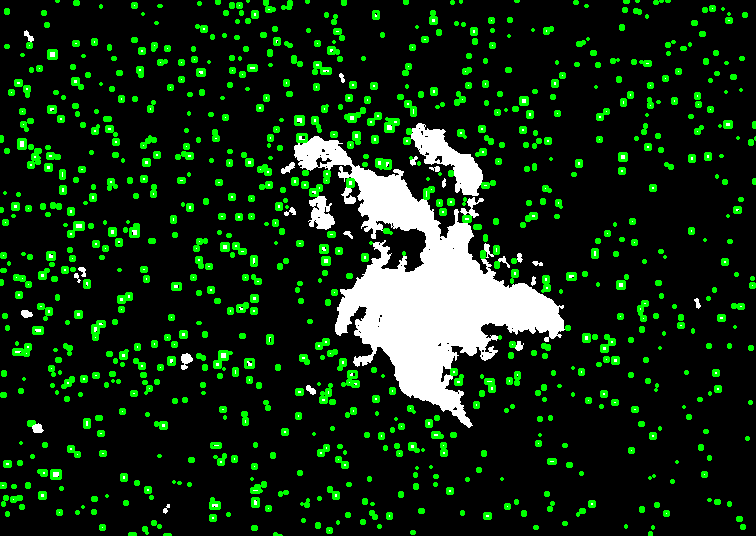
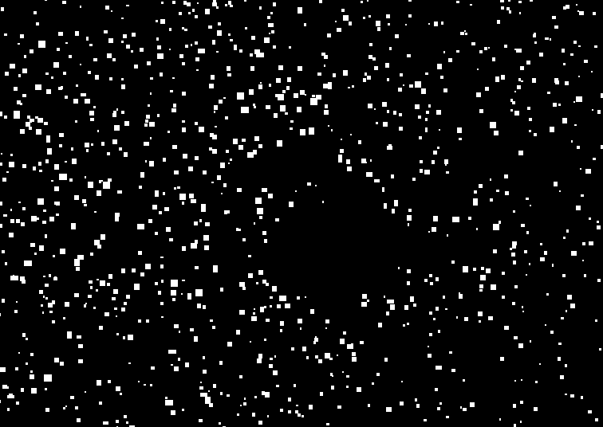
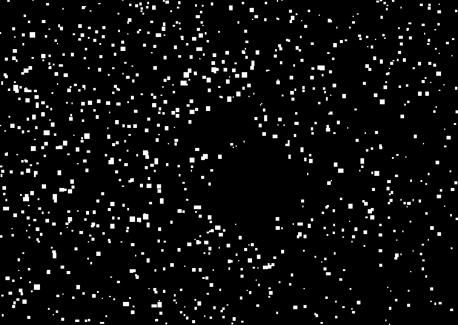
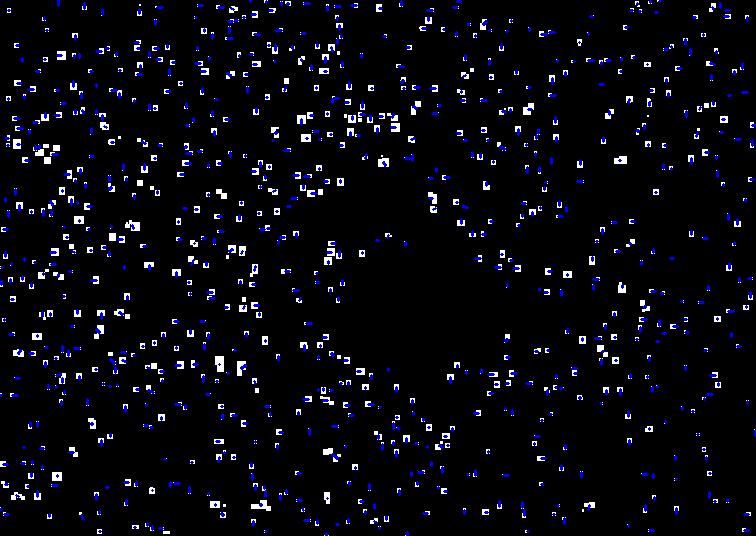
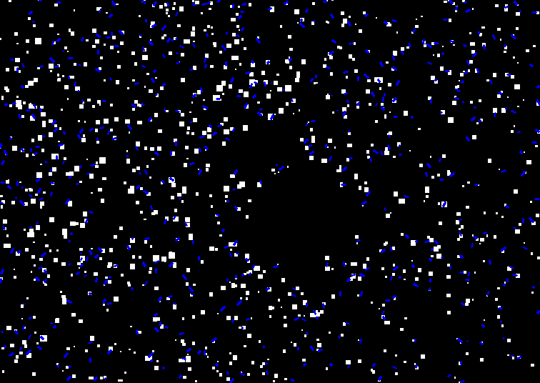

# stars_tracking

---

# I - Image base

---



# II - black and white picture

---



# III - Find track of stars

---



# IV - Generate new picture

---

```bash
export PYTHONPATH=$(pwd)
python3 tools/generate_picutre.py assets/test_1.png 5
```

- 5 correspond to number of pictures to generate





### TO generate gif of the pictures

```bash
python3 tools/generate_gif.py generate/ my_gif.gif
```

# V - Apply tracking of all pictures

---

Generating a picture with vector of stars mouvement





# VI - Run main code

```bash
python3 main.py assets/test_1.png 
```