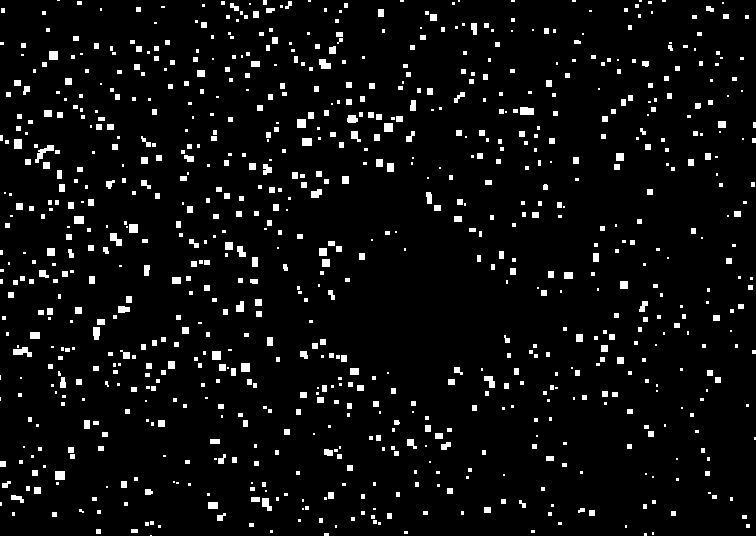

# stars_tracking

---

# I - Image base

---


# II - black and white picture

---


# III - Find track of stars

---


# IV - Generate new picture

---

```bash
export PYTHONPATH=$(pwd)
python3 tools/generate_picutre.py assets/test_1.png 5
```




# V - Apply tracking of all pictures